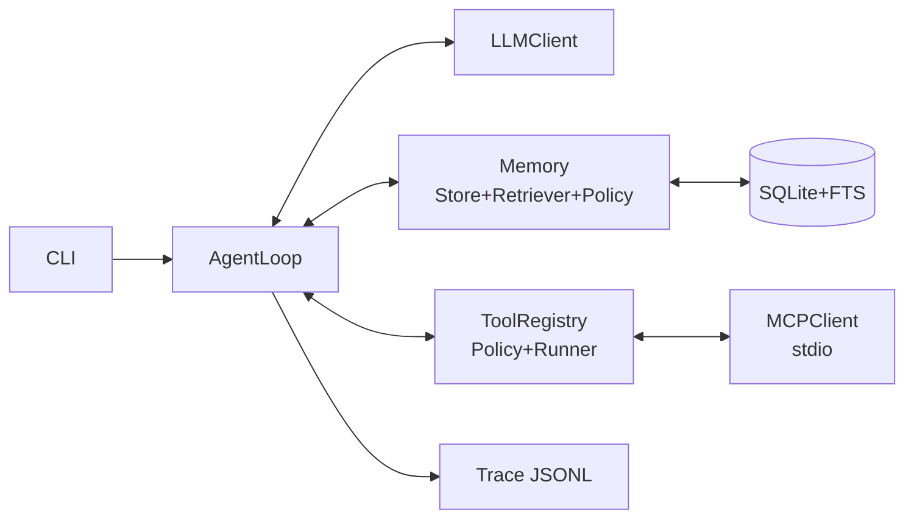

# 简易 Agent（纯 CLI 单进程）实现蓝图

目标：参考本仓库（opencode）的组织方式，搭一个可直接开工的最小 Agent：具备 agent loop、记忆（短期+长期）、技能（本地 skills）、以及 MCP tools 调用。本文只给技术方案与可施工接口清单，不执行实现。

---

## 1. 范围与非目标

- 范围
  - 单进程 CLI：`agent run "..."`（单轮）与 `agent chat`（多轮）
  - Agent loop：LLM 决策 → 工具调用（可多次）→ 观察结果 → 继续/结束
  - 记忆：SQLite 持久化 + FTS 检索（RAG-lite），支持会话摘要
  - 技能：本地 TypeScript 函数 tools
  - MCP：通过 stdio transport 连接一个或多个 MCP server，动态列出 tools 并调用
  - 可观测：每个 turn 产出 trace（JSONL）
- 非目标（后续再做）
  - HTTP Server / OpenAPI 暴露（此方案仅 CLI）
  - 多 agent 协作、分布式执行、复杂向量库
  - 细粒度权限系统与沙箱执行（先用策略门控）

---

## 2. 总体架构



核心原则：
- 编排（Loop）与能力（Memory/Tools/MCP/LLM）解耦，便于替换与测试。
- 所有工具输出先规范化成 `ToolRes` 再写回上下文，避免“模型看到半结构化噪声”。
- 先做 FTS 检索与规则摘要，后续再升级 embeddings。

---

## 3. 推荐目录结构

```txt
agent/
  src/
    cli.ts
    config.ts

    agent/
      loop.ts
      state.ts
      prompt.ts
      limits.ts

    llm/
      index.ts
      openai.ts
      mock.ts

    memory/
      store.ts
      schema.ts
      retrieve.ts
      policy.ts
      summarize.ts

    tool/
      types.ts
      registry.ts
      policy.ts
      local.ts
      runner.ts
      mcp.ts

    mcp/
      client.ts
      types.ts
      transport/
        stdio.ts

    trace/
      types.ts
      bus.ts
      sink-jsonl.ts

    util/
      json.ts
      time.ts
```

---

## 4. 数据模型（TypeScript 类型）

### 4.1 消息与 LLM 输出

```ts
export type Role = "system" | "user" | "assistant" | "tool"

export type Msg = {
  role: Role
  content: string
  name?: string
  tool_call_id?: string
}

export type ToolCall = {
  id: string
  name: string
  input: unknown
}

export type LlmOut =
  | { type: "final"; text: string }
  | { type: "tool"; calls: ToolCall[]; text?: string }
```

### 4.2 Tool 定义与结果规范化

```ts
export type Safety = "read_only" | "write" | "external_network"

export type ToolDef = {
  name: string
  description: string
  schema: unknown
  safety: Safety
  kind: "local" | "mcp"
}

export type ToolRes = {
  ok: boolean
  content: string
  data?: unknown
  error?: { code: string; message: string }
}
```

### 4.3 记忆条目

```ts
export type MemType = "fact" | "preference" | "summary" | "artifact" | "decision"

export type MemItem = {
  id: string
  session_id?: string | null
  type: MemType
  text: string
  tags: string[]
  created_at: number
}
```

---

## 5. Memory：SQLite 表结构与检索

### 5.1 表结构（schema.sql）

```sql
CREATE TABLE IF NOT EXISTS sessions (
  id TEXT PRIMARY KEY,
  created_at INTEGER NOT NULL,
  updated_at INTEGER NOT NULL,
  summary TEXT NOT NULL DEFAULT ''
);

CREATE TABLE IF NOT EXISTS messages (
  id TEXT PRIMARY KEY,
  session_id TEXT NOT NULL,
  role TEXT NOT NULL,
  content TEXT NOT NULL,
  name TEXT,
  tool_call_id TEXT,
  created_at INTEGER NOT NULL
);

CREATE TABLE IF NOT EXISTS memory (
  id TEXT PRIMARY KEY,
  session_id TEXT,
  type TEXT NOT NULL,
  text TEXT NOT NULL,
  tags TEXT NOT NULL,
  created_at INTEGER NOT NULL
);

CREATE VIRTUAL TABLE IF NOT EXISTS memory_fts USING fts5(
  text,
  tags,
  content='memory',
  content_rowid='rowid'
);

CREATE TRIGGER IF NOT EXISTS memory_ai AFTER INSERT ON memory BEGIN
  INSERT INTO memory_fts(rowid, text, tags) VALUES (new.rowid, new.text, new.tags);
END;

CREATE TRIGGER IF NOT EXISTS memory_ad AFTER DELETE ON memory BEGIN
  INSERT INTO memory_fts(memory_fts, rowid, text, tags) VALUES ('delete', old.rowid, old.text, old.tags);
END;

CREATE TRIGGER IF NOT EXISTS memory_au AFTER UPDATE ON memory BEGIN
  INSERT INTO memory_fts(memory_fts, rowid, text, tags) VALUES ('delete', old.rowid, old.text, old.tags);
  INSERT INTO memory_fts(rowid, text, tags) VALUES (new.rowid, new.text, new.tags);
END;
```

### 5.2 检索策略（FTS + bm25）

- 输入：`query = 用户输入 + 可选任务摘要`
- SQL：
  - `SELECT m.* FROM memory_fts f JOIN memory m ON m.rowid=f.rowid WHERE memory_fts MATCH ? ORDER BY bm25(memory_fts) LIMIT ?`
- 后处理：
  - 过滤空文本
  - 按 type 优先级：`preference/fact > decision > artifact > summary`

---

## 6. Tools：本地技能 + MCP tools

### 6.1 ToolRegistry 聚合与命名

- 本地工具：直接注册 `ToolDef + run(input)`。
- MCP 工具：从每个 MCP server `tools/list` 拉取并映射为 `ToolDef`。
- 命名建议：`mcp.${server}.${tool}`，避免冲突且方便做 allowlist。

### 6.2 ToolPolicy（安全与资源限制）

- `read_only`：默认允许
- `write`：需要 `ALLOW_WRITE_TOOLS=true`
- `external_network`：需要 `ALLOW_NETWORK_TOOLS=true`
- 对每个工具调用：
  - 超时（例如 15s）
  - 输出截断（例如 32KB），避免撑爆上下文

### 6.3 本地工具最小集合（先内置 3 个）

- `echo`（read_only）：回显输入
- `time`（read_only）：输出当前时间
- `remember`（write）：写入 memory（只影响本地 DB，不触外部）

---

## 7. MCP：最小实现（stdio transport）

目标：只支持 `tools/list` 与 `tools/call`，足够跑通 “模型选工具 → 通过 MCP 调用 → 回填结果”。

### 7.1 抽象接口

```ts
export type Mcp = {
  list(): Promise<McpTool[]>
  call(name: string, input: unknown): Promise<McpCallRes>
  close(): Promise<void>
}
```

### 7.2 stdio transport 要点

- 启动子进程：`cmd + args`
- JSON-RPC：
  - `id` 自增
  - stdout 逐行解析 JSON
  - 请求超时与异常统一包装

### 7.3 MCP 结果规范化

- MCP 返回的多段内容统一拼成 `ToolRes.content`（模型可读）
- 结构化字段放 `ToolRes.data`（后续 UI/调试可用）

---

## 8. AgentLoop：状态机与伪代码

```mermaid
flowchart TD
  U[User Input] --> R[Retrieve Memory]
  R --> L[LLM Decide]
  L -->|tool call| T[Run Tool (Local/MCP)]
  T --> O[Observe: tool msg + memory policy]
  O --> L
  L -->|final| A[Answer]
```

### 8.1 终止条件（建议默认）

- `maxSteps`：12
- `maxToolCalls`：8
- `timeoutMs`：60s
- 重复调用保护：同一 `tool+input` 连续出现 2 次直接终止（或要求模型改计划）

### 8.2 Loop 伪代码

```ts
export async function runTurn(cfg, deps, session, text) {
  deps.trace.emit({ type: "turn_start", session, text, ts: Date.now() })

  await deps.mem.appendMsg(session, { role: "user", content: text })

  const start = Date.now()
  let steps = 0
  let calls = 0

  while (true) {
    steps++
    if (steps > cfg.limits.maxSteps) return end("max_steps")
    if (Date.now() - start > cfg.limits.timeoutMs) return end("timeout")

    const hits = await deps.mem.retrieve(session, text, cfg.mem.topK)
    deps.trace.emit({ type: "retrieve", query: text, hits: hits.length, ts: Date.now() })

    const tools = await deps.tools.list()
    const msgs = await deps.mem.buildContext(session, hits, cfg, tools)

    deps.trace.emit({ type: "llm_request", ts: Date.now(), tools: tools.length, msg: msgs.length })
    const out = await deps.llm.complete(msgs, tools, cfg.llm)
    deps.trace.emit({ type: "llm_response", ts: Date.now(), out })

    if (out.type === "final") {
      await deps.mem.appendMsg(session, { role: "assistant", content: out.text })
      await deps.mem.maybeSummarize(session, cfg)
      deps.trace.emit({ type: "turn_end", ts: Date.now(), text: out.text })
      return { text: out.text, trace: deps.trace.id }
    }

    for (const call of out.calls) {
      calls++
      if (calls > cfg.limits.maxCalls) return end("max_calls")

      deps.trace.emit({ type: "tool_call", ts: Date.now(), call })
      const res = await deps.tools.run(call, cfg.tool)
      deps.trace.emit({ type: "tool_result", ts: Date.now(), id: call.id, res })

      await deps.mem.appendMsg(session, {
        role: "tool",
        content: res.content,
        name: call.name,
        tool_call_id: call.id,
      })

      for (const item of deps.mem.policy.afterTool(session, call, res, cfg)) {
        await deps.mem.write(item)
        deps.trace.emit({ type: "memory_write", ts: Date.now(), item })
      }
    }
  }

  async function end(reason: string) {
    const text = `终止：${reason}`
    await deps.mem.appendMsg(session, { role: "assistant", content: text })
    deps.trace.emit({ type: "turn_end", ts: Date.now(), text })
    return { text, trace: deps.trace.id }
  }
}
```

---

## 9. Prompt 组织（强烈建议固定模板）

输入给模型的 messages 建议按顺序：

1) System：运行规则 + 工具调用格式要求 + 安全约束  
2) Memory block：检索命中的长期记忆（压缩为 bullet）  
3) Session summary：会话摘要（如果有）  
4) Recent messages：最近 N 条 user/assistant/tool 消息（避免全量）

System 关键要求（简化版）：
- 工具可用时优先使用工具获取事实，不要编造工具结果。
- 工具调用必须给出：`id/name/input`，并且 input 必须符合 schema。
- 工具失败需要说明原因，并决定重试/换工具/降级回答。

---

## 10. 逐文件接口清单（施工对照）

### `src/config.ts`
- `cfg(): Cfg`
- `type Cfg` 字段建议：
  - `llm`：provider/model/key/baseUrl
  - `db`：path
  - `trace`：dir/on
  - `mem`：topK/maxMsgs/summarizeAt
  - `tool`：allowWrite/allowNet/timeoutMs/maxOut
  - `mcp`：servers[]
  - `limits`：maxSteps/maxCalls/timeoutMs

### `src/cli.ts`
- `main(argv: string[]): Promise<void>`
- 命令：
  - `run "<text>" --session <id?>`
  - `chat --session <id?>`
  - `mem ls --session <id?> --limit 20`
  - `msg ls --session <id?> --limit 50`

### `src/agent/*`
- `state.ts`：核心类型
- `prompt.ts`：`build(cfg, msgs, hits, tools): Msg[]`
- `limits.ts`：步数、超时、重复调用保护
- `loop.ts`：`runTurn(cfg, deps, session, text)`

### `src/llm/*`
- `index.ts`：`mkLlm(cfg): Llm`
- `openai.ts`：`mkOpenAI(cfg): Llm`
- `mock.ts`：`mkMock(queue: LlmOut[]): Llm`

### `src/memory/*`
- `store.ts`：SQLite 存取：appendMsg/listMsg/write/retrieve/getSummary/setSummary
- `retrieve.ts`：FTS 查询封装
- `policy.ts`：afterTool/afterFinal 生成 MemItem[]
- `summarize.ts`：maybeSummarize（规则摘要优先）

### `src/tool/*`
- `types.ts`：ToolDef/ToolRes/Safety
- `local.ts`：locals(): Local[]
- `mcp.ts`：mkMcpHub(cfg): McpHub
- `registry.ts`：mkTools(local, mcp, policy): Tools
- `policy.ts`：allow/cap
- `runner.ts`：run(call, defs, cfg)

### `src/mcp/*`
- `client.ts`：mkMcp(serverCfg): Mcp
- `transport/stdio.ts`：mkStdio(cmd, args, env): Transport（JSON-RPC）

### `src/trace/*`
- `types.ts`：事件 union
- `bus.ts`：mkTrace(cfg): Trace
- `sink-jsonl.ts`：JSONL 落盘

---

## 11. scripts 与最小依赖建议（纯 Bun）

依赖建议保持最少：
- DB：Bun 内置 `bun:sqlite`
- 测试：`bun test`
- CLI 参数解析：先手写（`Bun.argv`），后续再换 yargs/commander

推荐 scripts（概念示例）：
- `dev`：`bun run src/cli.ts run "hello" --session demo`
- `chat`：`bun run src/cli.ts chat --session demo`
- `test`：`bun test`
- `typecheck`：`bun --bun tsc -p tsconfig.json --noEmit`
- `db:init`：执行 schema 初始化（可写成 `scripts/db-init.ts`）

---

## 12. 测试计划（先用 mock LLM 跑通闭环）

- `loop.test.ts`
  - mock LLM：第 1 次返回 tool call，第 2 次返回 final
  - 断言：tool result 写回 messages；最终输出等于预期；trace 存在
- `memory.test.ts`
  - 写入 memory 2 条，检索 query 命中 topK
- `mcp-mapping.test.ts`
  - fake MCPClient 返回 tools/list，断言映射后的 ToolDef 命名与 schema 正确

---

## 13. 开工顺序（不容易卡）

1) `config.ts` 与 `trace/*`（可快速看到每步事件）
2) `memory/store.ts`（messages + memory + fts）
3) `tool/local.ts` + `tool/registry.ts`（先不接 MCP）
4) `llm/mock.ts` + `agent/loop.ts`（跑通 loop）
5) `mcp/transport/stdio.ts` + `mcp/client.ts`（连通 MCP）
6) `tool/mcp.ts`（把 MCP tools 注入 registry）
7) `memory/policy.ts` + `memory/summarize.ts`（记忆质量提升）

---

## 14. 与 opencode 的对照入口（便于“借鉴但不照抄”）

- MCP 相关实现位置（仓库内参考）：[packages/opencode/src/mcp](file:///Users/bytedance/Desktop/opencode/opencode/packages/opencode/src/mcp)
- Tool/Skill 组织方式参考：  
  - [packages/opencode/src/tool](file:///Users/bytedance/Desktop/opencode/opencode/packages/opencode/src/tool)  
  - [packages/opencode/src/skill](file:///Users/bytedance/Desktop/opencode/opencode/packages/opencode/src/skill)
- Session/LLM 相关参考：  
  - [packages/opencode/src/session/llm.ts](file:///Users/bytedance/Desktop/opencode/opencode/packages/opencode/src/session/llm.ts)

